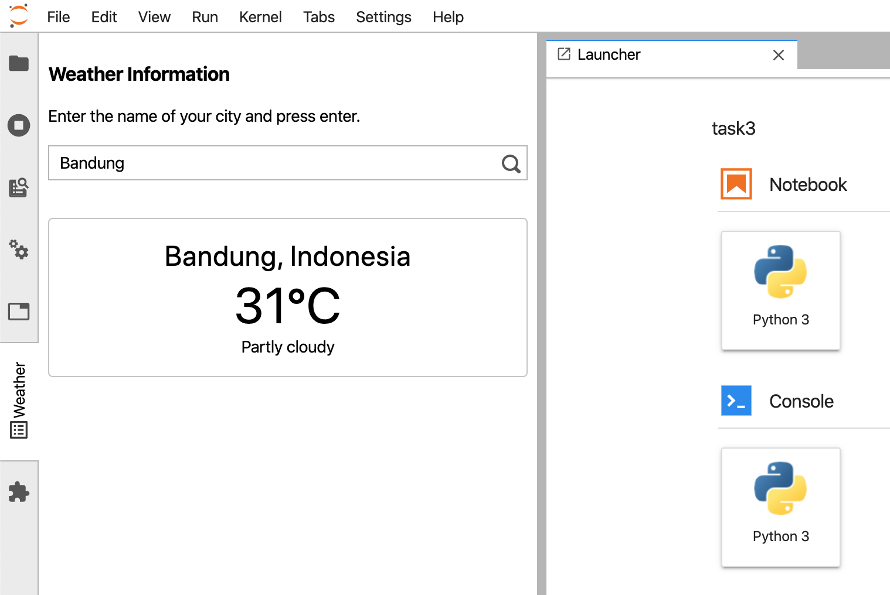

# Weather Data JupyterLab Extension
This folder contains the source code of JupyterLab extension that accesses weather data and displays it on the left sidebar panel.

### Installation
Execute the following script
```sh
$ cd ./task2/weather
$ jupyter labextension install .
```

### How it works
The extension is made up almost entirely using TypeScript using the [extension-cookiecutter-ts](https://github.com/jupyterlab/extension-cookiecutter-ts) boilerplate.
It consists of several components:
1. `index.ts` which serves as the entrypoint of the extension that implements the `JupyterLab.IPluginModule` interface
2. `panel.tsx` which contains the code to present the panel
3. `view.tsx` which contains the React component to fetch and display the data

The extension works like this:
- When the user do a search query, the extension will do an HTTP request to the weather API.
- Upon successful HTTP request, the extension will display the weather data on the panel.


### Screenshots
#### Left Sidebar Panel

