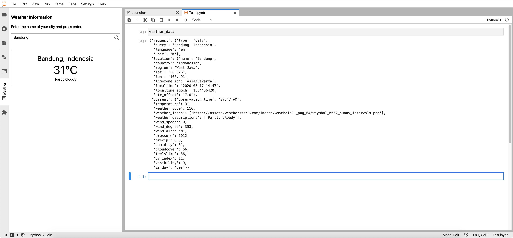

# Weather Data JupyterLab Extension with Kernel Access
This folder contains the source code of JupyterLab extension that accesses weather data and makes it accessible to the kernel through variable that is injected to the user's namespace.

### Data Source
The weather data is retrieved from [weatherstack](https://weatherstack.com). Please create your own API Access Key and follow the instructions on the sidebar to configure the extension.

### Installation
Execute the following script
```sh
$ jupyter labextension install @didithilmy/gsoc-cern-weather
```
Then, create a Weatherstack API Access Key, and follow the instruction on the sidebar panel to configure the API Access Key.

### How it works
The extension is made up almost entirely using TypeScript using the [extension-cookiecutter-ts](https://github.com/jupyterlab/extension-cookiecutter-ts) boilerplate.
It consists of several components:
1. `index.ts` which serves as the entrypoint of the extension that implements the `JupyterLab.IPluginModule` interface
2. `kernel.ts` which facilitates communication between the UI and the kernels
3. `panel.tsx` which contains the code to present the panel
4. `view.tsx` which contains the React component to fetch and display the data

The extension works like this:
- It listens to `runningChanged` signal to know when a new Kernel is spawned.
    - When a new Kernel is spawned, `Kernel.IKernelConnection.requestExecute` is called to inject the comm receiver into the kernel. The following code is invoked in the kernel:
  
    ```python
    class WeatherDataConnector():
        def __init__(self, ipython):
            self.ipython = ipython
        
        def register_comm(self):
            self.ipython.kernel.comm_manager.register_target("${COMM_NAME}", self.target_func)
    
        def target_func(self, comm, msg):
            self.comm = comm
    
            @self.comm.on_msg
            def _recv(msg):
              self.ipython.push({'${VARIABLE_NAME}': msg['content']['data']})

    connector = WeatherDataConnector(get_ipython())
    connector.register_comm()
    ```
    - The extension will also send a message to the comm that consists of the weather data it has retrieved. The kernel extension will inject the data into the user namespace.
- When the user do a search query, the extension will do an HTTP request to the weather API
- Upon successful HTTP request, the extension will display the weather data on the panel, and send a message to the comm containing the weather data
    - First the extension gets all running sessions using `JupyterLabFrontend.serviceManager.sessions.running()`
    - Then it creates a connection to all the running kernels
    - Finally, it sends the message

### Screenshots
#### Left Sidebar Panel


#### Notebook

